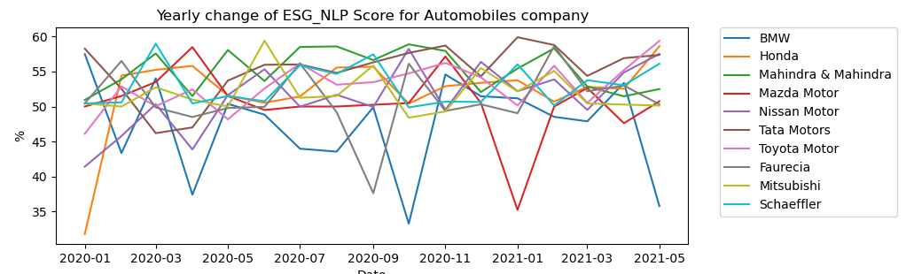

# AI in ESG Investing competition project - AM team

This project consists of Python scripts related to downloading, managing, and using the necessary data for calculating the ESG indicator. In this file, you can find the short comment of inserted files in a repository.

## Requirements

All the required packages are included in [requirements.txt](./requirements.txt) in a repository. Please keep them in mind if you want to check the usage of our scripts.  

## Organizations

Our selected companies for this analysis are - **BP, Equinor, Hindustan Petroleum, Bharat Petroleum, DCC, PBF ENERGY, Z Energy, Murphy USA, Petronet LNG Limited, Senex Energy, Mahindra & Mahindra, Honda, BMW, Tata Motors, Toyota Motor, Nissan Motor, Faurecia, Schaeffler, Mitsubishi, Mazda Motor**. All companies with their codes:
|Index |Name |Refinitiv |Twitter |Indeed |Guardian |Type |
| :---: | --- | --- | --- | --- | --- | :---: |
|1|BP|BP.L|bp_plc|BP|BP|Oil & Gas|
|2|Equinor|EQNR.OL|Equinor|Equinor|Equinor|Oil & Gas|
|3|Hindustan Petroleum|HPCL.NS|HPCL|Hindustan-Petroleum|Hindustan Petroleum|Oil & Gas|
|4|Bharat Petroleum|BPCL.NS|BPCLimited|Bharat-Petroleum-Co|Bharat Petroleum|Oil & Gas|
|5|DCC|DCC.L|dccplc|Dcc|DCC|Oil & Gas|
|6|PBF ENERGY|PBF.N|#PBFEnergy|Pbf-Energy|PBF ENERGY|Oil & Gas|
|7|Z Energy|ZEL.NZ|zenergynz|Z-Energy|Z Energy|Oil & Gas|
|8|Murphy USA|MUSA.N|MurphyUSA|Murphy-USA|Murphy USA|Oil & Gas|
|9|Petronet LNG Limited|PLNG.NS|PetronetLNGLtd|Petronet-Lng-Limite|Petronet LNG|Oil & Gas|
|10|Senex Energy|SXY.AX|SenexEnergy|Senex-Energy|Senex Energy|Oil & Gas|
|11|Mahindra & Mahindra|MAHM.NS|MahindraRise|Mahindra-&-Mahindra|Mahindra|Automobiles|
|12|Honda|7267.T|Honda|Honda|Honda|Automobiles|
|13|BMW|BMWG.DE|BMW|BMW-Group|BMW|Automobiles|
|14|Tata Motors|TAMO.NS|TataMotors|Tata-Motors|Tata Motors|Automobiles|
|15|Toyota Motor|7203.T|Toyota|Toyota|Toyota|Automobiles|
|16|Nissan Motor|7201.T|Nissan|Nissan|Nissan|Automobiles|
|17|Faurecia|EPED.PA|Faurecia|Faurecia|Faurecia|Automobiles|
|18|Schaeffler|SHA_p.DE|SchaefflerGroup|Schaeffler-Group|Schaeffler|Automobiles|
|19|Mitsubishi|7211.T|mitsucars|Mitsubishi|Mitsubishi|Automobiles|
|20|Mazda Motor|7261.T|MazdaUSA|Mazda|Mazda|Automobiles|

# Downloading data

## Refinitv API component

For Refinitv News API (Eikon API), we have created the [Python Notebook](./ESG_News_Refinitiv.ipynb). The first part of the code is related to making the connection with Eikon API. For more information about Eikon Data API please check the [documentation](https://developers.refinitiv.com/en/api-catalog/eikon/eikon-data-api).
Organizations' names are coded in specific titles known for Refinitiv to identify the exact company. All news from Refinitiv are in english. For this specific case, we have selected specific dates (taking into account the limitation of APIs) Dates **2020-01-01:2020-06-01, 2020-06-02:2020-12-31, 2021-01-01:2021-12-31**.

Also, we have selected specific topics for our crucial variables:
* Environmental (env)- this news is related to greenwashing campaigns presented by the organization. It also consists of the ecology aspect of a company and the management of generated wastes,
* Governance (gov_con) - in this case, the news is oriented on controversies in the company - like tax affairs, corporate controversies, and bribery attempts,
* CEO (ceo) - for this category, the news is related to information about the CEO and the decisions or action taken by the CEO,
* Cybersecurity (cyb) - the last area consists of keywords related to cyber threats and name of them. Additionally, it consists of topics related to hacking and scamming. 

All topics and keywords used are:

|Variable| Topic| Keywords|
| :---: | --- | --- |
|Environmental|Topic:ESGENV|green washing, greenwashing, green-washing, green sheen, greensheen, green marketing, green PR, greenscamming, green scamming, green-scamming, greenscam,green scam, green business, green speak, greenspeak, environment protection, ecology, radioactive waste, hazardous waste, illegal dumping, fly dumping, toxic waste dumping, electronic waste, toxic waste|
|Governance|Topic:CRPTAX, Topic:CVALU, Topic:CASE1, Topic:BKRT, Topic:REGS, Topic:CVRSY, Topic:BRIB, Topic:ACCI, Topic:BUYB, Topic:ESGGOV|tax fraud, governance controversies|
|CEO|Topic:CEO1|CEO, CE, chief executive officer, chief administrator, chief executive, CEO succession, CEO controversy, CEO said, director, boss, CEO response, CEO scandal, CEO fraud, CEO action, CEO apologizes, CEO crime, CEO retirement, CEO retiring, CEO explains, CEO helps|
|Cybersecurity|Topic:SCAM1, Topic:HACK|cybersecurity, cyber security, cyber-security, personal data leak, data leak, phishing, malware, ransomware, cyber attack, cyberattack, cyberattack, cyberthreat, cyber threat, cyber-threat, fake call, ddos, Social engineering, Backdoor, cyber vulnerabilities, cybercriminal|

## Guardian API component

In the case of The Guardian official API, we have created the [Python file](./guardian_news_api.py) to examine the API. For more information about this API, please check the [documentation](https://open-platform.theguardian.com/documentation/).

We have built the query with the parameters related to used keywords and companies. The variables are related to:
* Environmental (env)- this news is related to greenwashing campaigns presented by the organization. It also consists of the ecology aspect of a company and the management of generated wastes. All keywords used in this step are: **green washing, greenwashing, green-washing, green sheen, greensheen, green marketing, green PR, greenscamming, green scamming, green-scamming, greenscam, green scam, green business, green speak, greenspeak, environment protection, ecology, radioactive waste, hazardous waste, illegal dumping, fly dumping, toxic waste dumping, electronic waste, toxic waste, environment, ecology**

* Governance (gov_con) - in this case, the news is oriented on controversies in the company - like tax affairs, corporate controversies, and bribery attempts. All topics and keywords used in this scenario are: **audit inconsistencies, tax fraud, governance controversies, corporate governance**

* CEO (ceo) - for this category, the news is related to information about the CEO and the decisions or action taken by the CEO. All topics and keywords used are: **CEO, CE, chief executive officer, chief administrator, chief executive, CEO succesion, CEO controversy, CEO said, director, boss, CEO respond, CEO scandal, CEO fraud, CEO action, CEO apologizes, CEO crime, CEO retirement, CEO retiring, CEO explains, CEO helps**

* Cybersecurity (cyb) - the last area consists of keywords related to cyber threats and name of them. All topics and keywords used are: **scam, hack, cybersecurity, cyber security, cyber-security, personal data leak, data leak, phishing, malware, ransomware, cyber attack, cyberattack, cyberattack','cyberthreat, cyber threat, cyber-threat, fake call, ddos, Social engineering, Backdoor, cyber vulnerabilities, cybercriminal**.

## Twitter API component

For Twitter API we have created the [Python file](./twitter_api.py). It is connecting to Twitter API with conrete credencials. In this case, we have used the free Premium Sandbox Twitter API for full archive - limited to 50 requests in a month. For more information about Twitter API, please visit [Twitter documentation](https://developer.twitter.com/en/docs) or [Developer Portal](https://developer.twitter.com/en). All downloaded tweets are in english language.

To select the correct Tweets, we have built two queries. All of them are limited to date from 2020-01-01. Max tweets per request are 100 due to the limitation of Twitter API. Constructed by us queries are:

* Social - this query represents the company tweets. It is limited to a specific company only and doesn't include the mentions of other users. The exact query: **from:? lang:en -has:mentions**, where **?** means *company name*,

* Environmental - this query includes the hashtags about the environment and greenwashing. Tweets have to mention the company Twitter account. The exact query: **(#greenwashing OR #greenscam OR #environment OR #ecology) @? lang:en**, where **?** means *company name*.

The output of this Python file is *CSV* files with Social and Environmental tweets (*tweet, date, company name*).

## Indeed Web Scraper

For Indeed we have proposed the Web Scaper written as [Python file](./indeed_scraper.py). It helps to download reviews for selected companies. All reviews are written in English, and all countries take part in them. Web Scraper was designed with good practices (also ethical and lawful).

This script downloads the reviews for the selected company, and then it saves them in a *CSV* file as output. There are 20 reviews per page. To download these reviews we have to use the BeautifulSoup4 package and Tag selector.

# Sentiment analysis

After slight adjustments and cleaning of downloaded data, we have used the pretrained **roBERTa model** to calculate the percentage possibilities of sentiment (if it is positive, neutral, or negative). After that, we have transferred the data to *CSV* output. This allowed us to analyze the sentiment of a document with high precision in a relatively short time. We have prepared the four **Python Notebooks**:

* [Python Notebook for The Guardian news sentiment analysis](./Guardian%20sentiment%20with%20BERT.ipynb),
* [Python Notebook for Indeed reviews sentiment analysis](./Indeed%20sentiment%20with%20BERT.ipynb) ,
* [Python Notebook for Refinitiv news sentiment analysis](./Refinitiv%20sentiment%20with%20BERT.ipynb) ,
* [Python Notebook for Twitter sentiment analysis](./Sentiment_Analysis_with_BERT.ipynb).

# ESG indicator calculating

The last section of our work was to calculate the ESG components and made the complete ESG score. To accomplish that, we have used the wages method. At first, we had to download, clean, and link our data. To do that, we have created the new [Python Notebook](./calculation_of_ESG.ipynb). It also consists of ESG indicator calculation. The output of this **Notebook** is saved as an *Excel* file.

Created charts:

Comparation between Refinitiv ESG Score and Refinitiv ESG Score adjusted by our ESG Score for 2020 year:
|Company|Type|Refinitiv ESG Scorem Adjusted|Refinitiv ESG Score|
| :---: | :---: | :---: | :---: |
|BMW|Automobiles|77,63|88,63|
|Faurecia|Automobiles|68,39|71,48|
|Honda|Automobiles|82,47|87,92|
|Mahindra & Mahindra|Automobiles|83,84|89,35|
|Mazda Motor|Automobiles|63,34|65,44|
|Mitsubishi|Automobiles|67,08|71,89|
|Nissan Motor|Automobiles|72,10|70,14|
|Schaeffler|Automobiles|68,62|65,98|
|Tata Motors|Automobiles|78,74|85,23|
|Toyota Motor|Automobiles|74,44|76,23|

|Company|Type|Refinitiv ESG Scorem Adjusted|Refinitiv ESG Score|
| :---: | :---: | :---: | :---: |
|Bharat Petroleum|Oil & Gas|59,55|62,80|
|BP|Oil & Gas|77,47|87,32|
|DCC|Oil & Gas|48,79|48,47|
|Equinor|Oil & Gas|73,46|79,89|
|Hindustan Petroleum|Oil & Gas|61,84|63,51|
|Murphy USA|Oil & Gas|32,62|26,51|
|PBF ENERGY|Oil & Gas|31,98|34,14|
|Petronet LNG Limited|Oil & Gas|30,25|22,98|
|Senex Energy|Oil & Gas|31,69|27,77|
|Z Energy|Oil & Gas|46,72|41,15|

